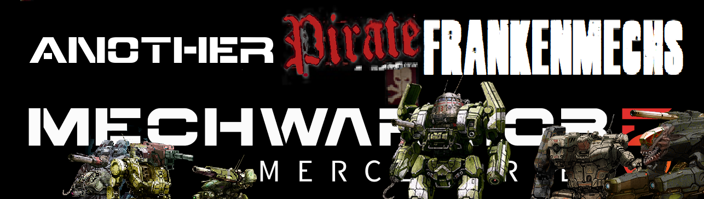

# Pirate_FrankenMechs
Source files for [Mechwarrior 5 Unreal Engine 4 MOD](https://www.nexusmods.com/mechwarrior5mercenaries/mods/886) editor with new pirate battlemech variants and chassis.

- Gunhed LCT-GUN (25T): A very modified LCT-3V Locust with its entire left torso & arm weapon system made from a "FOUND" Marauder-II cannon turret. Faction Rarity  {Periphery: Rare; Bandits, Outlaws and Pirates: Uncommon}

- Javelin 10NF (30T): 1/2 side JVN-10N + 1/2 side JVN-10F. Faction Rarity  {Davion: Very rare; Free Rasalhague Republic: Very rare; Mercenaries: Very rare; Periphery: Very rare; Bandits; Outlaws and Pirates: Uncommon; FederatedCommonwealth: Very rare}

- Termite SDR-FLE (30T): An unsalvageable damage Spider + a crippled Flea fused together to fix each other. Faction Rarity  {Periphery: Rare; Bandits, Outlaws and Pirates: Uncommon}

- Jallinder JVN-SHD (35T): A Javelin chassis with cannon parts from a Shadow Hawk for some wanna be pirate version of the Hollander. Faction Rarity  {Periphery: Rare; Bandits, Outlaws and Pirates: Uncommon}

- Cicada CDA-TR4SH (40T): A Cicada made-up from every weapons of other Cicadas. Faction Rarity  {Periphery: Very rare; Bandits, Outlaws and Pirates: Uncommon}

- HunHunchee HBK-BNC (50T): A modified Hunchback 4G chassis with an Banshee right arm. Faction Rarity  {Periphery: Very rare, Bandits, Outlaws and Pirates: Uncommon}

- Catapult CPLT-C1K2 (65T): 1/2 side CPLT-C1 + 1/2 side CPLT-K2. Faction Rarity  {Free Rasalhague Republic: Rare; Bandits, Outlaws and Pirates: Very rare}

- Black Marauder MAD-DRK1 (75T): Some heavily modified version of the Marauder 3R variant, but cursed. Faction Rarity  {Periphery: Very Rare, Bandits, Outlaws and Pirates: Rare}

            _(º)_
           [//^\\]
          //\\0//\\
          I |"x"| I
          W J'-'L W
            I   I
            A   A
           '^' '^'
- Urbinator CGR-UM (85T): CGR-1A1 Charger fixed with UrbanMech parts. Faction Rarity  {Periphery: Very Rare; Bandits, Outlaws and Pirates: Uncommon}

- Battlemaster BLR-KNT (85T): A very downgraded version of the BLR-1G 'Mech. Easier to maintain as it removes the missiles and PPC for more medium lasers and has a sword. Faction Rarity  {Independents: Very rare; Periphery: Rare; Bandits, Outlaws and Pirates: Rare}

[END]
